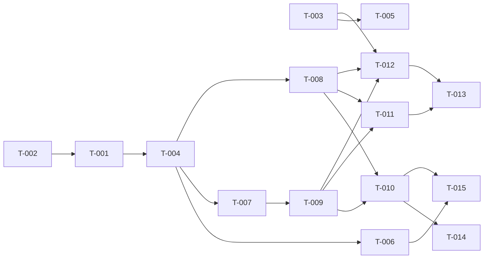

# Build Site

15 tasks across 7 tiers from 3 kits.

## Build Policy

- Builders MUST NOT commit. The whole feature (kits, build site, implementation, tests) ships as ONE commit after all tasks pass.
- The pre-existing untracked `.github/copilot-instructions.md` and `.github/git-commit-instructions.md` are not part of this feature and must not be staged.
- All banner logic (rule-set definitions, rule apply, create, include, exclude) lives in the single class `Brizy_Admin_Blocks_CookieBanner` (`admin/blocks/cookie-banner.php`), with rules read and written through `Brizy_Admin_Rules_Manager`. No other new classes.
- Tasks in the same tier that edit the same source file MUST run sequentially, never in parallel: T-007 then T-008 (Tier 3), and T-010 then T-011 (Tier 5), all editing `admin/blocks/cookie-banner.php`. Tasks that only add their own test file may run alongside them.

---

## Tier 0 — No Dependencies (Start Here)

| Task | Title | Cavekit | Requirement | Effort |
|------|-------|------|------------|--------|
| T-002 | Create banner class: skeleton, per-site uid, trash-aware lookup | cavekit-cookie-banner-block.md | R1 | S |
| T-003 | Persist `cookie-banner-enabled` boolean in common storage | cavekit-cookie-banner-setting.md | R2 | S |

---

## Tier 1 — Depends on Tier 0

| Task | Title | Cavekit | Requirement | blockedBy | Effort |
|------|-------|------|------------|-----------|--------|
| T-001 | Define include-all and exclude-all rule sets on the banner class | cavekit-cookie-banner-rules.md | R1, R2 | T-002 | S |
| T-005 | Render the "Enable Cookie Banner" checkbox on the General tab | cavekit-cookie-banner-setting.md | R1 | T-003 | S |

---

## Tier 2 — Depends on Tier 1

| Task | Title | Cavekit | Requirement | blockedBy | Effort |
|------|-------|------|------------|-----------|--------|
| T-004 | Apply a rule set as full replacement, verified by read-back | cavekit-cookie-banner-rules.md | R3 | T-001 | M |

---

## Tier 3 — Depends on Tier 2

| Task | Title | Cavekit | Requirement | blockedBy | Effort |
|------|-------|------|------------|-----------|--------|
| T-006 | Verify rule-set effect on Brizy frontend rendering | cavekit-cookie-banner-rules.md | R4 | T-004 | M |
| T-007 | Enable creates the banner block from the Default Payload | cavekit-cookie-banner-block.md | R2 | T-004 | M |
| T-008 | Disable applies exclude-all to an existing block | cavekit-cookie-banner-block.md | R4 | T-004 | S |

---

## Tier 4 — Depends on Tier 3

| Task | Title | Cavekit | Requirement | blockedBy | Effort |
|------|-------|------|------------|-----------|--------|
| T-009 | Enable on an existing block: restore to publish, keep content | cavekit-cookie-banner-block.md | R3 | T-007 | M |

---

## Tier 5 — Depends on Tier 4

| Task | Title | Cavekit | Requirement | blockedBy | Effort |
|------|-------|------|------------|-----------|--------|
| T-010 | Flag all content for recompilation on first creation only | cavekit-cookie-banner-block.md | R5 | T-008, T-009 | S |
| T-011 | Outcome reporting, failure paths, convergence and repair | cavekit-cookie-banner-block.md | R6 | T-008, T-009 | M |
| T-012 | Detect value transitions and call enable/disable | cavekit-cookie-banner-setting.md | R3 | T-003, T-008, T-009 | M |

---

## Tier 6 — Depends on Tier 5

| Task | Title | Cavekit | Requirement | blockedBy | Effort |
|------|-------|------|------------|-----------|--------|
| T-013 | Failure handling on the General save | cavekit-cookie-banner-setting.md | R4 | T-011, T-012 | M |
| T-014 | Human review: banner renders after first creation [CONDITIONAL] | cavekit-cookie-banner-block.md | R5 | T-010 | S |
| T-015 | Human review: banner placed at bottom position [CONDITIONAL] | cavekit-cookie-banner-rules.md | R4 | T-006, T-010 | S |

---

## Task Details

### T-001: Define include-all and exclude-all rule sets on the banner class
- **Build:** Add public `includeAllRules()` and `excludeAllRules()` to `Brizy_Admin_Blocks_CookieBanner` (class created by T-002, hence the dependency). Each returns a one-element `Brizy_Admin_Rule[]`: `new Brizy_Admin_Rule(null, Brizy_Admin_Rule::TYPE_INCLUDE /* or TYPE_EXCLUDE */, null, '', [])`. No WordPress state touched.
- **Validates:** rules R1 AC1-AC5, rules R2 AC1-AC5.
- **Tests:** `tests/unit/BrizyAdminBlocksCookieBannerRuleSetsTest.php`: each set has count 1; `assertSame` on `getType()` (1 / 2), `getAppliedFor()` (null), `getEntityType()` (''), `getEntityValues()` ([]).
- **blockedBy:** T-002

### T-002: Create banner class: skeleton, per-site uid, trash-aware lookup
- **Build:** Create `Brizy_Admin_Blocks_CookieBanner` in `admin/blocks/cookie-banner.php` (autoloader maps it; no include). This is the only task that creates the file. Constructor takes optional `Brizy_Admin_Blocks_Manager` (default `new Brizy_Admin_Blocks_Manager(Brizy_Admin_Blocks_Main::CP_GLOBAL)`) and optional `Brizy_Admin_Rules_Manager` (default `new Brizy_Admin_Rules_Manager()`), both kept for later tasks and injectable in tests. `getUid()` returns `'brz-cookie-banner-' . get_current_blog_id()`. `findBlock()` returns a `Brizy_Editor_Block` or null via `getEntities(['post_status' => ['publish','future','draft','pending','private','trash'], 'meta_key' => 'brizy_post_uid', 'meta_value' => $uid, 'orderby' => 'ID', 'order' => 'ASC'])`. Do not use `getEntity()`: its `'any'` status skips trash.
- **Validates:** block R1 AC1, AC2, AC4 (lookup half: a trashed block is found).
- **Tests:** `tests/functional/CookieBannerIdentityCest.php` (cleanup pattern from `BrizyAdminBlocksManagerCest::_before`): uid is `brz-cookie-banner-1` on single site; with `$GLOBALS['blog_id']` temporarily set to N (or `switch_to_blog(N)` if the suite runs multisite) uid is `brz-cookie-banner-N`; a trashed `brizy-global-block` fixture with the uid is returned by `findBlock()` while `getEntity($uid)` returns null.
- **blockedBy:** none

### T-003: Persist `cookie-banner-enabled` boolean in common storage
- **Build:** In `Brizy_Admin_Settings::general_settings_submit()` (`admin/settings.php`) compute `isset($_POST['cookie-banner-enabled'])` and store it with `Brizy_Editor_Storage_Common::instance()->set('cookie-banner-enabled', $bool)`. The reader follows the existing settings design, where each feature class owns its static reader (`Brizy_Admin_Svg_Main::isSvgEnabled()`, `Brizy_Admin_Json_Main::isJsonEnabled()`, `Brizy_Admin_GettingStarted::isVideoEnabled()`): add static `Brizy_Admin_Blocks_CookieBanner::isCookieBannerEnabled(): bool` returning `(bool) Brizy_Editor_Storage_Common::instance()->get('cookie-banner-enabled', false)` (second arg = do not throw when unset; it is not a default). The write is unconditional here; T-012/T-013 gate it.
- **Validates:** setting R2 AC1-AC6 (the "unless R4 applies" branch of AC4/AC5 is validated in T-013).
- **Tests:** `tests/functional/CookieBannerSettingPersistenceCest.php`: populate `$_POST` (tab=general plus existing fields), call `Brizy_Admin_Settings::_init()->general_settings_submit()`; checked gives `=== true`, field absent gives `=== false`; after `delete('cookie-banner-enabled')` the reader returns false; value readable from the same `Brizy_Editor_Storage_Common` instance as `svg-upload`.
- **blockedBy:** none

### T-004: Apply a rule set as full replacement, verified by read-back
- **Build:** Add public `applyRules($postId, array $rules): bool` to `Brizy_Admin_Blocks_CookieBanner`: `$this->rulesManager->setRules($postId, $rules)`, then `getRules($postId)`; return true only when counts match and each rule matches on `type`, `appliedFor`, `entityType`, `entityValues` (normalize: int type, `array_values` entityValues). Ignore the write's return value (`saveRules()` is void; the meta update returns false on unchanged values).
- **Validates:** rules R3 AC1-AC9.
- **Tests:** `tests/functional/CookieBannerApplyRulesCest.php` on a fixture global-block post: seed custom rules (e.g. include page X plus exclude category Y), apply, then exactly one rule, all four fields match, custom rules gone; include then exclude gives one rule type 2; exclude then include gives one rule type 1; applying twice leaves identical `brizy-rules` meta and both return true; applying a set already present returns true; failure: starting from different rules, an `update_post_metadata` filter short-circuiting `brizy-rules` gives false; a `get_post_metadata` filter altering one field on read-back gives false.
- **blockedBy:** T-001

### T-005: Render the "Enable Cookie Banner" checkbox on the General tab
- **Build:** `get_general_tab()` passes `'cookieBannerEnabled' => Brizy_Admin_Blocks_CookieBanner::isCookieBannerEnabled()`; `admin/views/settings/general.php` gets a new `<tr>` inside the existing `<form>`/`<tbody>` with `_e('Enable Cookie Banner', 'brizy')` and `<input type="checkbox" id="cookie-banner-enabled" name="cookie-banner-enabled" value="1">`, `checked` only when true. Same submit button (`brizy-general-submit`).
- **Validates:** setting R1 AC1-AC5.
- **Tests:** `tests/functional/CookieBannerSettingFieldCest.php`: call `get_general_tab()` via reflection with stored true / false / unset; parse with `DOMDocument`: checkbox present with label `Enable Cookie Banner`, inside the same `<form>` as `input[name=tab][value=general]` and the submit button; `checked` present only for true.
- **blockedBy:** T-003

### T-006: Verify rule-set effect on Brizy frontend rendering
- **Build:** Verification only; no production code expected. If a scenario fails, fix it in the rules/placeholder path. No site-wide injection (Architect Notes).
- **Validates:** rules R4 AC1-AC4, AC6, AC7; AC5 by automated proxy only (visual placement is human review, T-015).
- **Tests:** `tests/functional/CookieBannerRenderCest.php`: fixture global block with position align `bottom` and seeded compiled HTML (`getCompiledSectionManager()->merge()` + `setCompiledSections()`, as in `Brizy_Admin_Blocks_Api::actionCreateGlobalBlock`); a Brizy post, a Brizy page, a Brizy archive template and a Brizy single template (`editor-template` with rules). Render via `Brizy_Content_Placeholders_GlobalBlocks::getValue()` with `position=bottom` (context entity = post/page; template cases set `Brizy_Admin_Templates::$template` via reflection, reset after). Include-all (via `applyRules()`): output has `<!-- GLOBAL BLOCK [{id}]-->` in all four; exclude-all: absent in all four; switch include to exclude to include with a fresh render after each, asserting compiled HTML and `brizy-post-compiler-version` meta of block and pages are unchanged; proxy for AC5: `position=top` output lacks the block.
- **blockedBy:** T-004

### T-007: Enable creates the banner block from the Default Payload
- **Build:** `Brizy_Admin_Blocks_CookieBanner::enable(): bool`. When `findBlock()` (T-002) is null: `createEntity($uid, 'publish')` (only after the trash-aware lookup, because `createEntity`'s duplicate check skips trash), `setTitle('Cookie Banner')`, `setPosition(Brizy_Editor_BlockPosition::createFromSerializedData(['align'=>'bottom','top'=>0,'bottom'=>0]))`, `setDependencies([])`, `setMeta()` with the payload meta JSON, `setEditorData()` with the payload `data` JSON (`<siteId>` replaced), `save()`; then `$this->applyRules($id, $this->includeAllRules())`. Payload lives in `getDefaultPayload()`; its `rules` entry is never passed to `addRules`/`createRulesFromJson`. Return true when creation and apply both succeed.
- **Validates:** block R2 AC1-AC10; block R1 AC5 (created block is in the editor list).
- **Tests:** `tests/functional/CookieBannerEnableCreateCest.php`: clean global blocks, enable returns true; trash-aware count for the uid is 1; title, `post_status` publish, position align/top/bottom, dependencies `[]`, decoded meta and editor data equal the payload (siteId substituted); rules equal include-all; `added_post_meta`/`updated_post_meta` hooks record exactly one `brizy-rules` write during enable; uid present in `getEntities(['post_status' => 'any'])` (same call as `actionGetGlobalBlocks`).
- **blockedBy:** T-004

### T-008: Disable applies exclude-all to an existing block
- **Build:** `Brizy_Admin_Blocks_CookieBanner::disable(): bool`: `findBlock()`; null returns true without creating anything; otherwise return `$this->applyRules($id, $this->excludeAllRules())`. No status/title/data/meta/position change, no delete, no `save()`.
- **Validates:** block R4 AC1-AC6.
- **Tests:** `tests/functional/CookieBannerDisableCest.php`: fixture banner blocks (publish and draft) with include-all; disable gives exclude-all rules, block still exists, same status, same title/editor data/meta/position; with no block, disable returns true and trash-aware count stays 0.
- **blockedBy:** T-004

### T-009: Enable on an existing block: restore to publish, keep content
- **Build:** Extend `enable()`: when `findBlock()` returns a block whose status is not `publish`, restore it (`wp_untrash_post()` first for `trash`, then `wp_update_post(['ID' => ..., 'post_status' => 'publish'], true)`; `WP_Error`/0 means failure). No `save()` or setters on this path; then `applyRules()` with include-all. This path never creates a block. Blocked by T-007 because it extends the `enable()` method T-007 introduces.
- **Validates:** block R3 AC1-AC10; block R1 AC4 (enable side), AC5 (restored block is in the editor list).
- **Tests:** `tests/functional/CookieBannerEnableExistingCest.php`, data-driven over trash, draft, pending, private, publish: fixture block with custom title/editor data/meta/position and custom rules; enable returns true; count stays 1; status publish; title, editor data, meta, position identical (re-read after `wp_cache_flush()`); rules equal include-all; uid present in `getEntities(['post_status' => 'any'])`.
- **blockedBy:** T-007

### T-010: Flag all content for recompilation on first creation only
- **Build:** In the creation branch of `enable()`, call `Brizy_Editor_Post::markAllForCompilation()` right after the block `save()` and before `applyRules()`. Restore, re-enable, and disable paths never call it.
- **Validates:** block R5 AC1, AC2, AC4, AC5, AC6 (AC3 is human review, T-014).
- **Tests:** `tests/functional/CookieBannerRecompileCest.php`: seed a Brizy post with `Brizy_Editor_Post::BRIZY_POST_COMPILER_VERSION` meta set to a real version; creating enable resets it to `0.0.0`; same with an `update_post_metadata` filter failing `brizy-rules` writes (enable returns false, meta still `0.0.0`); restore from draft/trash, enable on publish, and disable leave the meta unchanged (seed after any creation).
- **blockedBy:** T-008, T-009

### T-011: Outcome reporting, failure paths, convergence and repair
- **Build:** `enable()`/`disable()` always return a bool and never throw: wrap manager and WordPress calls in try/catch, so `createEntity()` null, restore `WP_Error`/0, `applyRules()` false or any exception each give false. Repair relies on lookup, then restore, then apply (a half-created block is found and completed on the next enable).
- **Validates:** block R6 AC1-AC6; block R1 AC3.
- **Tests:** `tests/functional/CookieBannerOutcomeCest.php`: creation failure (`wp_insert_post_empty_content` returns true) gives false; restore failure (same filter, draft fixture) gives false; `brizy-rules` write short-circuit gives false on enable and on disable; every call asserts `is_bool`; enable three times gives one block, publish, include-all; toggle loop (enable, disable, trash, enable, disable, enable) leaves at most one block across publish/draft/pending/private/trash; repair: first enable with rule-write failure returns false and block exists, filter removed, second enable returns true with one block, publish, include-all.
- **blockedBy:** T-008, T-009

### T-012: Detect value transitions and call enable/disable
- **Build:** In `general_settings_submit()`: `$previous = Brizy_Admin_Blocks_CookieBanner::isCookieBannerEnabled()`, `$submitted = isset($_POST['cookie-banner-enabled'])`; false/unset to true calls `enable()` once; true to false calls `disable()` once; no change calls neither. Get the `Brizy_Admin_Blocks_CookieBanner` through an injectable accessor on `Brizy_Admin_Settings` (e.g. `getCookieBanner()` plus an `@internal` `setCookieBanner()` for test doubles). Run this outside the `if ($error_count == 0)` post-types branch. Keep storing the submitted value (T-013 adds success gating); keep T-003 tests green.
- **Validates:** setting R3 AC1-AC6.
- **Tests:** `tests/functional/CookieBannerSettingTransitionCest.php`: test-only spy subclass of `Brizy_Admin_Blocks_CookieBanner` (defined in the Cest file) counting calls: unset to true and false to true give one enable; true to false gives one disable; true to true and false/unset to false give zero calls. With the real class: unchecked save on a never-enabled site leaves trash-aware banner count 0; unchanged save on an enabled site with a customized banner leaves status, rules and editor data unchanged.
- **blockedBy:** T-003, T-008, T-009

### T-013: Failure handling on the General save
- **Build:** Use the bool from `enable()`/`disable()`: on false, skip writing `cookie-banner-enabled` (previous value stays) and call `Brizy_Admin_Flash::instance()->add_error()` with a translatable message; on true, write the submitted value. SVG, JSON, Getting Started video and post-types writes are independent of the banner result. `action_validate_form_submit()` already skips `Settings saved.` when an ERROR notice exists; no change needed there.
- **Validates:** setting R4 AC1-AC11; setting R2 AC4/AC5 "unless R4 applies" branch.
- **Tests:** `tests/functional/CookieBannerSettingFailureCest.php` with a test-only spy returning false: failed enable keeps false/unset; failed disable keeps true; `Brizy_Admin_Flash::instance()->has_notice_type(Brizy_Admin_Flash::ERROR)` is true; driving `action_validate_form_submit()` (valid nonce, `set_current_screen()` for the settings screen, a `wp_redirect` filter that throws to escape `exit`) queues no `Settings saved.` notice; post types, `svg-upload`, `json-upload`, `getting-started-video-enabled` are saved; invalid post type plus changed checkbox still calls the spy once; retry: failed enable then checked again calls enable a second time; same for disable.
- **blockedBy:** T-011, T-012

### T-014: Human review: banner renders after first creation [CONDITIONAL]
- **Condition:** A compiler build that supports the CookieBanner element is available in the review environment (compiler support is out of scope for these kits). If not met, record block R5 AC3 as pending human review; this does not block any other task.
- **Build:** None (manual verification, human review).
- **Validates:** block R5 AC3 (human review).
- **Steps:** On a site with no banner block (none in trash) and an already-compiled published Brizy page, run enable (settings checkbox once T-012 is done, or `wp eval '(new Brizy_Admin_Blocks_CookieBanner())->enable();'`); load the page once; confirm the HTML has the `<!-- GLOBAL BLOCK [id]-->` banner markup with the cookie text. Record the outcome in `context/impl/`.
- **blockedBy:** T-010

### T-015: Human review: banner placed at bottom position [CONDITIONAL]
- **Condition:** Same as T-014.
- **Build:** None (manual verification, human review). Automated proxy lives in T-006.
- **Validates:** rules R4 AC5 (human review).
- **Steps:** With include-all applied and the banner compiled, view a Brizy-built page and a Brizy-template page; confirm the banner renders in the bottom global-block slot (after page content), not the top slot. Can share a session with T-014. Record the outcome in `context/impl/`.
- **blockedBy:** T-006, T-010

---

## Summary

| Tier | Tasks | Effort |
|------|-------|--------|
| 0 | 2 | 2 S |
| 1 | 2 | 2 S |
| 2 | 1 | 1 M |
| 3 | 3 | 2 M, 1 S |
| 4 | 1 | 1 M |
| 5 | 3 | 2 M, 1 S |
| 6 | 3 | 1 M, 2 S |

**Total: 15 tasks, 7 tiers**

## Dependency Graph

## Coverage Matrix

| Cavekit | Req | Criterion | Task(s) | Status |
|---------|-----|-----------|---------|--------|
| cavekit-cookie-banner-rules.md | R1 | AC1 Include-all set has exactly one rule | T-001 | COVERED |
| cavekit-cookie-banner-rules.md | R1 | AC2 Rule `type` = 1 (include) | T-001 | COVERED |
| cavekit-cookie-banner-rules.md | R1 | AC3 Rule `appliedFor` = null | T-001 | COVERED |
| cavekit-cookie-banner-rules.md | R1 | AC4 Rule `entityType` = "" | T-001 | COVERED |
| cavekit-cookie-banner-rules.md | R1 | AC5 Rule `entityValues` = [] | T-001 | COVERED |
| cavekit-cookie-banner-rules.md | R2 | AC1 Exclude-all set has exactly one rule | T-001 | COVERED |
| cavekit-cookie-banner-rules.md | R2 | AC2 Rule `type` = 2 (exclude) | T-001 | COVERED |
| cavekit-cookie-banner-rules.md | R2 | AC3 Rule `appliedFor` = null | T-001 | COVERED |
| cavekit-cookie-banner-rules.md | R2 | AC4 Rule `entityType` = "" | T-001 | COVERED |
| cavekit-cookie-banner-rules.md | R2 | AC5 Rule `entityValues` = [] | T-001 | COVERED |
| cavekit-cookie-banner-rules.md | R3 | AC1 After apply, read-back returns exactly one rule | T-004 | COVERED |
| cavekit-cookie-banner-rules.md | R3 | AC2 Rule matches applied set in all four fields | T-004 | COVERED |
| cavekit-cookie-banner-rules.md | R3 | AC3 Prior custom (editor) rules removed | T-004 | COVERED |
| cavekit-cookie-banner-rules.md | R3 | AC4 Include to exclude: one rule, type 2 | T-004 | COVERED |
| cavekit-cookie-banner-rules.md | R3 | AC5 Exclude to include: one rule, type 1 | T-004 | COVERED |
| cavekit-cookie-banner-rules.md | R3 | AC6 Applying same set twice is idempotent | T-004 | COVERED |
| cavekit-cookie-banner-rules.md | R3 | AC7 Success exactly when read-back equals applied set | T-004 | COVERED |
| cavekit-cookie-banner-rules.md | R3 | AC8 Applying already-present set reports success | T-004 | COVERED |
| cavekit-cookie-banner-rules.md | R3 | AC9 Failure when read-back differs | T-004 | COVERED |
| cavekit-cookie-banner-rules.md | R4 | AC1 Include-all: in output of Brizy-built single post | T-006 | COVERED |
| cavekit-cookie-banner-rules.md | R4 | AC2 Include-all: in output of Brizy-built single page | T-006 | COVERED |
| cavekit-cookie-banner-rules.md | R4 | AC3 Include-all: in output of archive via Brizy template | T-006 | COVERED |
| cavekit-cookie-banner-rules.md | R4 | AC4 Include-all: in output of single via Brizy template | T-006 | COVERED |
| cavekit-cookie-banner-rules.md | R4 | AC5 Rendered at bottom position (human review) | T-006 (proxy), T-015 (human review) | COVERED |
| cavekit-cookie-banner-rules.md | R4 | AC6 Exclude-all: absent from all Brizy-rendered pages above | T-006 | COVERED |
| cavekit-cookie-banner-rules.md | R4 | AC7 Switch takes effect on next view, no recompilation | T-006 | COVERED |
| cavekit-cookie-banner-block.md | R1 | AC1 Single-site uid `brz-cookie-banner-1` | T-002 | COVERED |
| cavekit-cookie-banner-block.md | R1 | AC2 Multisite uid `brz-cookie-banner-N` | T-002 | COVERED |
| cavekit-cookie-banner-block.md | R1 | AC3 At most one block per uid across all statuses after toggles | T-011 | COVERED |
| cavekit-cookie-banner-block.md | R1 | AC4 Trashed block counts as existing; no second block | T-002, T-009 | COVERED |
| cavekit-cookie-banner-block.md | R1 | AC5 After enable, block in editor global-block list | T-007, T-009 | COVERED |
| cavekit-cookie-banner-block.md | R2 | AC1 Enable with no block leaves exactly one with uid | T-007 | COVERED |
| cavekit-cookie-banner-block.md | R2 | AC2 Title `Cookie Banner` | T-007 | COVERED |
| cavekit-cookie-banner-block.md | R2 | AC3 Status `publish` | T-007 | COVERED |
| cavekit-cookie-banner-block.md | R2 | AC4 Position align bottom, top 0, bottom 0 | T-007 | COVERED |
| cavekit-cookie-banner-block.md | R2 | AC5 Dependencies empty list | T-007 | COVERED |
| cavekit-cookie-banner-block.md | R2 | AC6 Meta overlay / cookieBanner / extraFontStyles [] | T-007 | COVERED |
| cavekit-cookie-banner-block.md | R2 | AC7 Editor data = payload `data` with siteId substituted | T-007 | COVERED |
| cavekit-cookie-banner-block.md | R2 | AC8 Rule set equals include-all after enable | T-007 | COVERED |
| cavekit-cookie-banner-block.md | R2 | AC9 Payload rules realized only via rules apply | T-007 | COVERED |
| cavekit-cookie-banner-block.md | R2 | AC10 Success when creation and rule apply succeed | T-007 | COVERED |
| cavekit-cookie-banner-block.md | R3 | AC1 Existing block: no new block, count stays 1 | T-009 | COVERED |
| cavekit-cookie-banner-block.md | R3 | AC2 `trash` restored to `publish` | T-009 | COVERED |
| cavekit-cookie-banner-block.md | R3 | AC3 `draft` restored to `publish` | T-009 | COVERED |
| cavekit-cookie-banner-block.md | R3 | AC4 Other non-published (pending, private) to `publish` | T-009 | COVERED |
| cavekit-cookie-banner-block.md | R3 | AC5 `publish` stays `publish` | T-009 | COVERED |
| cavekit-cookie-banner-block.md | R3 | AC6 Title unchanged | T-009 | COVERED |
| cavekit-cookie-banner-block.md | R3 | AC7 Editor data unchanged | T-009 | COVERED |
| cavekit-cookie-banner-block.md | R3 | AC8 Meta unchanged | T-009 | COVERED |
| cavekit-cookie-banner-block.md | R3 | AC9 Position unchanged | T-009 | COVERED |
| cavekit-cookie-banner-block.md | R3 | AC10 Rule set equals include-all after enable | T-009 | COVERED |
| cavekit-cookie-banner-block.md | R4 | AC1 Disable leaves exclude-all rule set | T-008 | COVERED |
| cavekit-cookie-banner-block.md | R4 | AC2 Block still exists (not deleted) | T-008 | COVERED |
| cavekit-cookie-banner-block.md | R4 | AC3 Status unchanged | T-008 | COVERED |
| cavekit-cookie-banner-block.md | R4 | AC4 Title, editor data, meta, position unchanged | T-008 | COVERED |
| cavekit-cookie-banner-block.md | R4 | AC5 No block: disable creates none | T-008 | COVERED |
| cavekit-cookie-banner-block.md | R4 | AC6 No block: disable reports success | T-008 | COVERED |
| cavekit-cookie-banner-block.md | R5 | AC1 Creating enable flags all content for recompilation | T-010 | COVERED |
| cavekit-cookie-banner-block.md | R5 | AC2 Flag set even if following rule write fails | T-010 | COVERED |
| cavekit-cookie-banner-block.md | R5 | AC3 Next view after creation shows banner (human review) | T-014 (human review) | COVERED |
| cavekit-cookie-banner-block.md | R5 | AC4 Restoring enable flags nothing | T-010 | COVERED |
| cavekit-cookie-banner-block.md | R5 | AC5 Enable on existing `publish` flags nothing | T-010 | COVERED |
| cavekit-cookie-banner-block.md | R5 | AC6 Disable flags nothing | T-010 | COVERED |
| cavekit-cookie-banner-block.md | R6 | AC1 Every enable reports success or failure | T-011 | COVERED |
| cavekit-cookie-banner-block.md | R6 | AC2 Every disable reports success or failure | T-011 | COVERED |
| cavekit-cookie-banner-block.md | R6 | AC3 Any enable step failure reports failure | T-011 | COVERED |
| cavekit-cookie-banner-block.md | R6 | AC4 Disable rule-apply failure reports failure | T-011 | COVERED |
| cavekit-cookie-banner-block.md | R6 | AC5 Repeated enable: one block, publish, include-all | T-011 | COVERED |
| cavekit-cookie-banner-block.md | R6 | AC6 Next enable repairs partial create, reports success | T-011 | COVERED |
| cavekit-cookie-banner-setting.md | R1 | AC1 General tab has `Enable Cookie Banner` checkbox | T-005 | COVERED |
| cavekit-cookie-banner-setting.md | R1 | AC2 Same form and save action as General options | T-005 | COVERED |
| cavekit-cookie-banner-setting.md | R1 | AC3 Checked when stored `true` | T-005 | COVERED |
| cavekit-cookie-banner-setting.md | R1 | AC4 Unchecked when stored `false` | T-005 | COVERED |
| cavekit-cookie-banner-setting.md | R1 | AC5 Unchecked when never stored | T-005 | COVERED |
| cavekit-cookie-banner-setting.md | R2 | AC1 Stored under key `cookie-banner-enabled` | T-003 | COVERED |
| cavekit-cookie-banner-setting.md | R2 | AC2 Stored as boolean | T-003 | COVERED |
| cavekit-cookie-banner-setting.md | R2 | AC3 Same store as other General options | T-003 | COVERED |
| cavekit-cookie-banner-setting.md | R2 | AC4 Checked submit stores `true` (unless R4) | T-003, T-013 | COVERED |
| cavekit-cookie-banner-setting.md | R2 | AC5 Unchecked submit stores `false` (unless R4) | T-003, T-013 | COVERED |
| cavekit-cookie-banner-setting.md | R2 | AC6 Never set reads `false` | T-003 | COVERED |
| cavekit-cookie-banner-setting.md | R3 | AC1 false/unset to true: enable called once | T-012 | COVERED |
| cavekit-cookie-banner-setting.md | R3 | AC2 true to false: disable called once | T-012 | COVERED |
| cavekit-cookie-banner-setting.md | R3 | AC3 true to true: neither called | T-012 | COVERED |
| cavekit-cookie-banner-setting.md | R3 | AC4 false/unset to false: neither called | T-012 | COVERED |
| cavekit-cookie-banner-setting.md | R3 | AC5 Unchecked save on never-enabled site creates no block | T-012 | COVERED |
| cavekit-cookie-banner-setting.md | R3 | AC6 Unchanged save leaves block status, rules, content | T-012 | COVERED |
| cavekit-cookie-banner-setting.md | R4 | AC1 Enable failure keeps previous value (false/unset) | T-013 | COVERED |
| cavekit-cookie-banner-setting.md | R4 | AC2 Disable failure keeps previous value (true) | T-013 | COVERED |
| cavekit-cookie-banner-setting.md | R4 | AC3 Failure shows error notice | T-013 | COVERED |
| cavekit-cookie-banner-setting.md | R4 | AC4 Failure suppresses `Settings saved.` notice | T-013 | COVERED |
| cavekit-cookie-banner-setting.md | R4 | AC5 Post types still saved on failure | T-013 | COVERED |
| cavekit-cookie-banner-setting.md | R4 | AC6 SVG uploads option still saved on failure | T-013 | COVERED |
| cavekit-cookie-banner-setting.md | R4 | AC7 JSON uploads option still saved on failure | T-013 | COVERED |
| cavekit-cookie-banner-setting.md | R4 | AC8 Getting Started video option still saved on failure | T-013 | COVERED |
| cavekit-cookie-banner-setting.md | R4 | AC9 Post-type validation error does not stop banner call | T-013 | COVERED |
| cavekit-cookie-banner-setting.md | R4 | AC10 After failed enable, checked resubmit calls enable again | T-013 | COVERED |
| cavekit-cookie-banner-setting.md | R4 | AC11 After failed disable, unchecked resubmit calls disable again | T-013 | COVERED |

**Coverage: 97/97 criteria (100%)**
